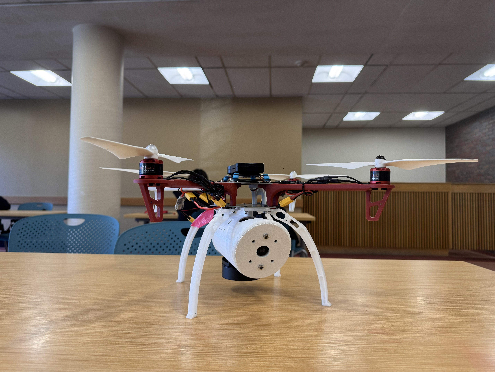
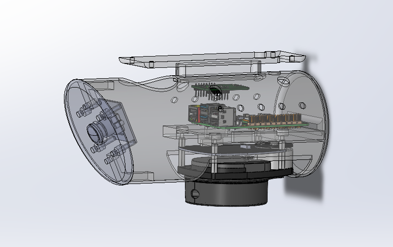

# Payload Housing: Mechanical Design

The enclosure that carries the LiDAR, camera, IMU, Pi 5, and power electronics, and attaches the assembly to an F450 airframe. Designed, printed, and integrated by me as part of the [search and rescue drone project](../README.md).

Finished payload: **0.76 kg**, PETG, cylindrical body with a detachable front face.
Designed in Solidworks

<!-- Replace these filenames with your actual uploads in hardware/images/ -->



## Housing requirements

The mechanical requirements came from the sensors and the airframe:

| Constraint | Where it came from |
|---|---|
| 360° unobstructed LiDAR horizon | The DFR0315 scans a full circle, so any structure in that plane becomes a permanent artifact in every map |
| Fixed, known camera angle | `person_mapper` composes a camera-to-body rotation as a constant. If the camera can shift, that constant is wrong and every projected detection is wrong |
| IMU near the payload center of mass | Off-axis mounting turns airframe rotation into spurious linear acceleration |
| Minimum mass | The F450 was already at its practical limit with battery and electronics |
| Attach to an existing airframe | The payload mounts to an F450 I did not design and could not modify |
| Serviceable between flights | Battery swaps and payload removal had to be fast |

## Design decisions

**LiDAR mounted upside down at the bottom of the payload.** This was the best available position on two counts. It keeps the scan plane well clear of the propeller disc, and it tucks the unit under the body where it is less exposed to damage on hard landings. The drone's legs still sit inside the scan plane, which is handled in software with a minimum range filter.

**Detachable angled front face.** The 25° downward camera tilt is printed into the geometry rather than set with an adjustable bracket. A fixed angle is a known angle, and `person_mapper` depends on that. Making the face detachable kept the camera serviceable without making the angle adjustable.

**Screwed to the underside of the drone's bottom plate, with a cork damping layer in the joint.** Mounting underneath left the battery bay clear, so batteries could be swapped between flights without touching the payload. The whole unit also comes off in a few screws, which was nice since the system was constantly being reopened for debugging. The cork takes some of the airframe vibration out of the joint before it reaches the sensors.

**PETG.** More flexible and less brittle than PLA, so it deforms under crash loads instead of shattering. That toughness is also what allowed thinner walls than PLA would have survived, which mattered given how tight the mass budget was.

Power sized from measurement, not from a datasheet guess. The battery was chosen after the sensors were settled, so the load was known before the capacity was. I ran the Pi and sensors together at the compute settings we expected to fly, measured actual draw, and picked a 3S LiPo that met a 30 minute minimum endurance target, then retested once the full system was wired to confirm the estimate held. Battery voltage goes through a U6223 step down converter regulated to 5V, with every component drawing power through the Pi rather than tapping the pack separately. We were carefule since a 3S pack sits at 11.1V nominal and up to 12.6V fresh off the charger, and any of that reaching a 5V input kills the board. A switch was connected between the step down converter for easy power toggle.

**Access and vent holes.** The body has multiple openings for cable routing, airflow over the Pi and buck converter and as access holes. Internal airflow is still limited and the IMU likely ran warm, though I have no measurements to say how much that mattered.

## What I would change

**Weight was the defining constraint.** The finished payload put the F450 over its rated maximum. The answer was a larger airframe with more thrust margin, but that was outside the project budget, so the only lever left was making the payload lighter. I redesigned the housing several times to cut mass, thinning walls and removing material wherever the structure allowed. It was not enough. The LiDAR, camera, and Pi are what they are, and the battery had to be large enough for a useful flight time, so the mass of the sensing and power hardware sat above the margin no matter what the enclosure weighed. The result was persistent difficulty keeping the drone stable, shorter test flights than planned, and less data collected than the project needed.

Next time I would size the mass budget against the airframe's measured thrust margin at the start and let it drive component selection, instead of choosing sensors first and trying to recover the difference in the enclosure.

**Foam tape was not enough isolation for the IMU.** It damped some vibration bu was it was clearly inadequate under spinning props. Motor vibration coupled into the accelerometer, which cannot separate it from real acceleration. A designed isolator with a corner frequency below the prop passing frequency is what I would build next time.

**Better separation between the IMU and the heat sources.** The vent holes helped, but I would move the IMU out of the same enclosed volume as the Pi and the buck converter. Even without knowing how much heat actually contributed to the drift, keeping a temperature sensitive sensor away from the two components dissipating the most power is cheap insurance.

## Files

```
cad/
├── *.stl       Print ready, GitHub renders these in the browser
└── *.sldprt    Native SolidWorks
images/         Build and assembly photos
```

Click any STL to rotate it in the browser without downloading.

## Notes

3D printed in PETG with a BAMBU A1 printer. The hardware was returned to the school when the course ended, so this is a design record rather than a live build.

Most of the compromises above come back to the same two limits. The budget fixed the airframe, which fixed the mass ceiling, which drove several rounds of housing redesign that still could not close the gap. The schedule meant the system had to be built, wired, printed, and integrated before any of it could be tested, so problems like the vibration coupling only surfaced late, with no time left to redesign around them. A lot of what looks like a sensing or software problem in this project traces back to those two constraints.
